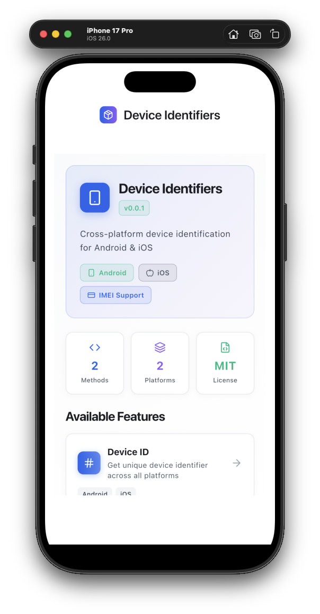
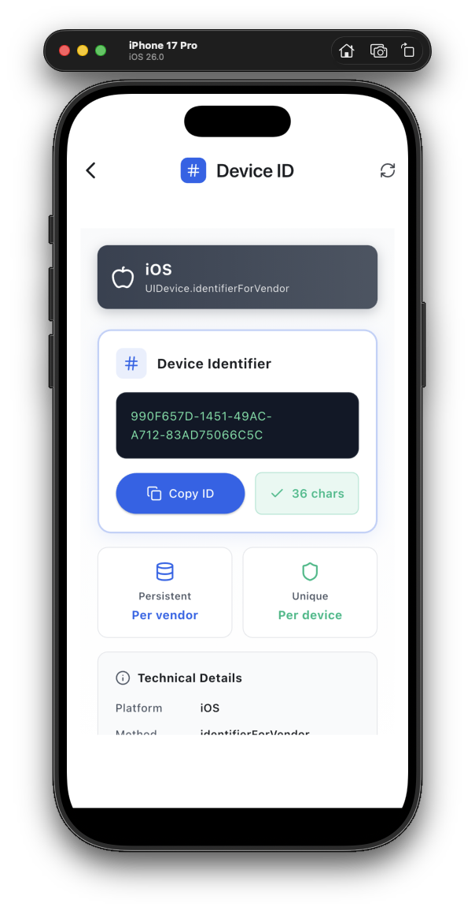

# 📱 device_identifiers

[](https://pub.dev/packages/device_identifiers)
[](https://opensource.org/licenses/MIT)

A lightweight, secure Flutter plugin that provides **unique device identifiers** for Android and iOS platforms. Perfect for analytics, device tracking, session management, and authentication flows.

<div align="center">
  
  
</div>

---

## ✨ Features

- 🎯 **Simple API** - Easy-to-use methods, minimal configuration
- 🔒 **Privacy-Focused** - Uses platform-recommended identifiers
- 📱 **Device ID** - Cross-platform unique identifier
- 🔢 **IMEI Support** - Android hardware identifier (with permission)
- ⚡ **Lightweight** - Minimal dependencies, maximum performance
- 🛡️ **Production-Ready** - Null-safe, tested, and reliable
- 🚀 **Easy Integration** - Drop-in solution with Flutter best practices

---

## 📊 Platform Support

| Platform | Device ID Method | IMEI Support | Requires Permission |
|----------|-----------------|--------------|---------------------|
| **Android** | `Settings.Secure.ANDROID_ID` | ✅ Yes | Device ID: No<br>IMEI: Yes (READ_PHONE_STATE) |
| **iOS** | `UIDevice.identifierForVendor` | ❌ No | No |

### Identifier Details

#### Device Identifier
| Platform | Format | Example | Persistence |
|----------|--------|---------|-------------|
| Android | 64-bit hex string | `9774d56d682e549c` | Per app reinstall |
| iOS | UUID (36 chars) | `E621E1F8-C36C-495A-93FC-0C247A3E6E5F` | Per vendor |

#### IMEI (Android Only)
| Property | Value |
|----------|-------|
| Format | 15-digit number |
| Example | `123456789012345` |
| Permission | READ_PHONE_STATE |
| Availability | Phones only (not tablets) |
| Persistence | Permanent (hardware ID) |

---

## 🚀 Getting Started

### Installation

Add `device_identifiers` to your `pubspec.yaml`:

```yaml
dependencies:
  device_identifiers: ^0.0.2
```

Then install the package:

```bash
flutter pub get
```

### Import

```dart
import 'package:device_identifiers/device_identifiers.dart';
```

---

## 💡 Usage

### Basic Examples

#### Get Device Identifier

```dart
import 'package:device_identifiers/device_identifiers.dart';

Future<void> getDeviceId() async {
  final String? deviceId = await DeviceIdentifiers.getDeviceIdentifier();
  
  if (deviceId != null) {
    print('Device ID: $deviceId');
  } else {
    print('Unable to get device identifier');
  }
}
```

#### Get IMEI (Android Only)

```dart
import 'package:device_identifiers/device_identifiers.dart';
import 'package:flutter/services.dart';

Future<void> getImei() async {
  try {
    final String? imei = await DeviceIdentifiers.getImei();
    
    if (imei != null) {
      print('IMEI: $imei');
    } else {
      print('IMEI not available (may be a tablet)');
    }
  } on PlatformException catch (e) {
    if (e.code == 'PERMISSION_DENIED') {
      print('READ_PHONE_STATE permission required');
      // Request permission using permission_handler or similar
    }
  }
}
```

### Complete Example with Error Handling & Permissions

```dart
import 'package:flutter/material.dart';
import 'package:flutter/services.dart';
import 'package:device_identifiers/device_identifiers.dart';
import 'package:permission_handler/permission_handler.dart';

class DeviceInfoScreen extends StatefulWidget {
  @override
  _DeviceInfoScreenState createState() => _DeviceInfoScreenState();
}

class _DeviceInfoScreenState extends State<DeviceInfoScreen> {
  String _deviceId = 'Loading...';
  String _imei = 'Not available';
  bool _isLoading = true;

  @override
  void initState() {
    super.initState();
    _loadDeviceInfo();
  }

  Future<void> _loadDeviceInfo() async {
    // Get Device ID (no permission needed)
    String deviceId;
    try {
      deviceId = await DeviceIdentifiers.getDeviceIdentifier() 
          ?? 'Unknown Device ID';
    } on PlatformException catch (e) {
      deviceId = 'Failed: ${e.message}';
    } catch (e) {
      deviceId = 'Error: $e';
    }

    // Get IMEI (Android only, requires permission)
    String imei = 'Not available (iOS or no permission)';
    if (Theme.of(context).platform == TargetPlatform.android) {
      try {
        final String? imeiValue = await DeviceIdentifiers.getImei();
        imei = imeiValue ?? 'Not available (tablet?)';
      } on PlatformException catch (e) {
        if (e.code == 'PERMISSION_DENIED') {
          imei = 'Permission denied - tap to grant';
        } else {
          imei = 'Error: ${e.message}';
        }
      }
    }

    if (!mounted) return;

    setState(() {
      _deviceId = deviceId;
      _imei = imei;
      _isLoading = false;
    });
  }

  Future<void> _requestPermissionAndGetImei() async {
    // Request permission
    final status = await Permission.phone.request();
    
    if (status.isGranted) {
      final imei = await DeviceIdentifiers.getImei();
      setState(() => _imei = imei ?? 'IMEI not available');
    } else if (status.isPermanentlyDenied) {
      // Open app settings
      await openAppSettings();
    }
  }

  @override
  Widget build(BuildContext context) {
    return Scaffold(
      appBar: AppBar(title: Text('Device Identifiers')),
      body: _isLoading
          ? Center(child: CircularProgressIndicator())
          : Padding(
              padding: EdgeInsets.all(24.0),
              child: Column(
                mainAxisAlignment: MainAxisAlignment.center,
                children: [
                  Text('Device ID:', style: TextStyle(fontWeight: FontWeight.bold)),
                  SizedBox(height: 8),
                  SelectableText(_deviceId, textAlign: TextAlign.center),
                  SizedBox(height: 24),
                  Text('IMEI:', style: TextStyle(fontWeight: FontWeight.bold)),
                  SizedBox(height: 8),
                  SelectableText(_imei, textAlign: TextAlign.center),
                  if (_imei.contains('Permission denied')) ...[
                    SizedBox(height: 16),
                    ElevatedButton(
                      onPressed: _requestPermissionAndGetImei,
                      child: Text('Grant Permission'),
                    ),
                  ],
                ],
              ),
            ),
    );
  }
}
```

### Permission Setup for IMEI (Android)

#### 1. Add permission to AndroidManifest.xml

The plugin automatically includes this, but if needed, ensure your app's `android/app/src/main/AndroidManifest.xml` has:

```xml
<manifest>
    <uses-permission android:name="android.permission.READ_PHONE_STATE" />
    ...
</manifest>
```

#### 2. Request permission at runtime

```dart
import 'package:permission_handler/permission_handler.dart';

Future<bool> requestPhonePermission() async {
  final status = await Permission.phone.status;
  
  if (status.isGranted) {
    return true;
  }
  
  final result = await Permission.phone.request();
  return result.isGranted;
}

// Use it before getting IMEI
Future<void> safelyGetImei() async {
  if (await requestPhonePermission()) {
    final imei = await DeviceIdentifiers.getImei();
    print('IMEI: $imei');
  } else {
    print('Permission not granted');
  }
}
```

---

#### 1. **Analytics & Tracking**
```dart
Future<void> trackUserSession() async {
  final deviceId = await DeviceIdentifiers.getDeviceIdentifier();
  
  await analytics.logEvent(
    name: 'session_start',
    parameters: {
      'device_id': deviceId,
      'timestamp': DateTime.now().toIso8601String(),
    },
  );
}
```

#### 2. **Device-Specific Settings**
```dart
Future<void> saveDeviceSettings() async {
  final deviceId = await DeviceIdentifiers.getDeviceIdentifier();
  
  if (deviceId != null) {
    await prefs.setString('device_${deviceId}_theme', 'dark');
    await prefs.setBool('device_${deviceId}_notifications', true);
  }
}
```

#### 3. **Rate Limiting / Anti-Abuse**
```dart
Future<bool> checkRateLimit() async {
  final deviceId = await DeviceIdentifiers.getDeviceIdentifier();
  
  if (deviceId != null) {
    final attempts = await database.getLoginAttempts(deviceId);
    return attempts < 5; // Max 5 attempts per device
  }
  
  return false;
}
```

#### 4. **Device Registration**
```dart
Future<void> registerDevice(String userId) async {
  final deviceId = await DeviceIdentifiers.getDeviceIdentifier();
  
  if (deviceId != null) {
    await api.registerDevice(
      userId: userId,
      deviceId: deviceId,
      platform: Platform.isAndroid ? 'android' : 'ios',
      registeredAt: DateTime.now(),
    );
  }
}
```

---

## 🔍 Platform-Specific Details

### Android

#### What is ANDROID_ID?
`Settings.Secure.ANDROID_ID` is a 64-bit number (expressed as a hexadecimal string) that remains consistent for the lifetime of the app on a device.

#### Characteristics:
- ✅ Unique per app signing key + user + device combination
- ✅ Persists across app updates
- ✅ Different for each user profile on the same device
- ❌ Changes on app reinstall or factory reset
- ❌ Different for apps signed with different keys

#### Example Output:
```
9774d56d682e549c
```

#### When Does It Change?
- App is uninstalled and reinstalled
- Device is factory reset
- User clears app data (on some devices)
- Different signing key is used

---

### iOS

#### What is identifierForVendor?
`UIDevice.identifierForVendor` returns a UUID that identifies the device to the app's vendor.

#### Characteristics:
- ✅ Same for all apps from the same vendor (based on Bundle ID prefix)
- ✅ Persists across app updates
- ❌ Changes when all apps from the vendor are uninstalled
- ❌ May change after device restore from backup (in some cases)

#### Example Output:
```
E621E1F8-C36C-495A-93FC-0C247A3E6E5F
```

#### When Does It Change?
- All apps from the vendor are uninstalled
- Device is restored from backup (sometimes)
- iOS major version upgrade (rare)

#### Vendor Definition:
Apps are from the same vendor if they share the first two components of their Bundle ID:
- `com.example.app1` and `com.example.app2` → **Same vendor**
- `com.company.app` and `org.company.app` → **Different vendors**

---

## ⚠️ Important Considerations

### Privacy & Compliance

#### ✅ **DO:**
- Use for legitimate analytics and app functionality
- Inform users in your privacy policy
- Combine with user consent for tracking (GDPR, CCPA)
- Use for device-specific settings and preferences
- Implement as part of a multi-factor authentication system

#### ❌ **DON'T:**
- Use as a permanent user identifier
- Track users across uninstalls without consent
- Share device IDs with third parties without disclosure
- Rely on it for critical security (it can change)
- Use for cross-app tracking (violates platform policies)

### Best Practices

```dart
// ✅ GOOD: Combined with user ID
class UserSession {
  final String userId;
  final String? deviceId;
  final DateTime timestamp;
  
  Future<void> create() async {
    final deviceId = await DeviceIdentifiers.getDeviceIdentifier();
    // Store both user ID and device ID
    await saveSession(userId, deviceId);
  }
}

// ❌ BAD: Using device ID as primary identifier
class User {
  final String? deviceId; // Device ID can change!
  
  Future<void> login() async {
    final deviceId = await DeviceIdentifiers.getDeviceIdentifier();
    await loginWithDeviceId(deviceId); // Risky!
  }
}
```

---

## 🛠️ Technical Details

### Architecture

```
┌─────────────────────────────────────┐
│   Flutter App (Dart)                │
│   DeviceIdentifiers.getDeviceId()   │
└───────────────┬─────────────────────┘
                │
                ▼
┌─────────────────────────────────────┐
│   Platform Channel                  │
│   MethodChannel('device_identifiers')│
└───────────┬────────────┬────────────┘
            │            │
    ┌───────▼──────┐  ┌──▼──────────┐
    │   Android    │  │     iOS     │
    │   (Kotlin)   │  │   (Swift)   │
    └──────────────┘  └─────────────┘
```

### Dependencies

```yaml
dependencies:
  flutter: sdk
  plugin_platform_interface: ^2.0.0

dev_dependencies:
  flutter_test: sdk
  flutter_lints: ^6.0.0
```

### Minimum Requirements

- **Flutter:** >=1.17.0
- **Dart:** >=3.10.4
- **Android:** API 16+ (Android 4.1 Jelly Bean)
- **iOS:** 11.0+

---

## 🧪 Testing

### Run Tests

```bash
flutter test
```

### Example Test

```dart
import 'package:flutter_test/flutter_test.dart';
import 'package:device_identifiers/device_identifiers.dart';

void main() {
  test('getDeviceIdentifier returns non-null value', () async {
    final deviceId = await DeviceIdentifiers.getDeviceIdentifier();
    expect(deviceId, isNotNull);
    expect(deviceId, isNotEmpty);
  });
}
```

---

## 📚 API Reference

### Methods

#### `getDeviceIdentifier()`

Returns a unique identifier for the device.

**Returns:** `Future<String?>`
- **Android:** 64-bit hex string (e.g., `"9774d56d682e549c"`)
- **iOS:** UUID string (e.g., `"E621E1F8-C36C-495A-93FC-0C247A3E6E5F"`)
- **null:** If identifier cannot be retrieved

**Throws:** 
- `PlatformException` - If there's a platform-specific error

**Example:**
```dart
final String? deviceId = await DeviceIdentifiers.getDeviceIdentifier();
```

---

#### `getImei()`

Returns the IMEI (International Mobile Equipment Identity) of the device.

**Platform:** Android only (returns `null` on iOS)

**Returns:** `Future<String?>`
- **Android:** 15-digit IMEI string (e.g., `"123456789012345"`)
- **iOS:** Always returns `null`
- **null:** If IMEI cannot be retrieved (tablets, permission denied, etc.)

**Requires:**
- Android: `READ_PHONE_STATE` permission (must be requested at runtime for Android 6.0+)

**Throws:** 
- `PlatformException` with code `'PERMISSION_DENIED'` - If READ_PHONE_STATE permission not granted
- `PlatformException` - For other platform-specific errors

**Example:**
```dart
try {
  final String? imei = await DeviceIdentifiers.getImei();
  if (imei != null) {
    print('IMEI: $imei');
  } else {
    print('IMEI not available');
  }
} on PlatformException catch (e) {
  if (e.code == 'PERMISSION_DENIED') {
    print('Permission required: ${e.message}');
  }
}
```

**Important Notes:**
- IMEI is a hardware identifier and doesn't change (unlike Device ID)
- Only available on devices with cellular capability (phones, not tablets)
- Requires runtime permission on Android 6.0+
- Not accessible on iOS due to platform restrictions
- For Android 8.0+: Uses `TelephonyManager.getImei()`
- For Android < 8.0: Uses `TelephonyManager.getDeviceId()`

---

## 🐛 Troubleshooting

### Common Issues

#### Issue: Returns `null` on Android

**Solution:**
```dart
// Ensure you're calling from an async context
Future<void> init() async {
  await Future.delayed(Duration(milliseconds: 100));
  final id = await DeviceIdentifiers.getDeviceIdentifier();
}
```

#### Issue: Different IDs on Android emulators

**Explanation:** Emulators may return the same ID or change IDs between sessions. This is expected behavior. Always test on real devices for production validation.

#### Issue: iOS returns `null`

**Possible Causes:**
1. Device restrictions (MDM, parental controls)
2. Privacy settings
3. Running on simulator in certain conditions

**Solution:** Always handle `null` case in your code.

---

## 🔗 Related Packages

| Package | Description | Platforms |
|---------|-------------|-----------|
| [device_info_plus](https://pub.dev/packages/device_info_plus) | Comprehensive device information | All |
| [flutter_udid](https://pub.dev/packages/flutter_udid) | Alternative device ID solution | Android, iOS |
| [platform_device_id](https://pub.dev/packages/platform_device_id) | Multi-platform device IDs | All |

---

## 🤝 Contributing

Contributions are welcome! Please follow these steps:

1. Fork the repository
2. Create a feature branch (`git checkout -b feature/amazing-feature`)
3. Commit your changes (`git commit -m 'Add amazing feature'`)
4. Push to the branch (`git push origin feature/amazing-feature`)
5. Open a Pull Request

### Development Setup

```bash
git clone https://github.com/gurkanfikretgunak/device_identifiers.git
cd device_identifiers
flutter pub get
flutter test
flutter analyze
```

---

## 📄 License

This project is licensed under the MIT License - see the [LICENSE](LICENSE) file for details.

---

## 📮 Support

- 🐛 [Report a bug](https://github.com/gurkanfikretgunak/device_identifiers/issues)
- 💡 [Request a feature](https://github.com/gurkanfikretgunak/device_identifiers/issues)
- 📖 [Documentation](https://pub.dev/documentation/device_identifiers/latest/)
- ⭐ [Star on GitHub](https://github.com/gurkanfikretgunak/device_identifiers)

---

## 📊 Changelog

See [CHANGELOG.md](CHANGELOG.md) for a detailed list of changes.

---

<div align="center">

Made with ❤️ by developers, for developers

[⬆ Back to Top](#-device_identifiers)

</div>

